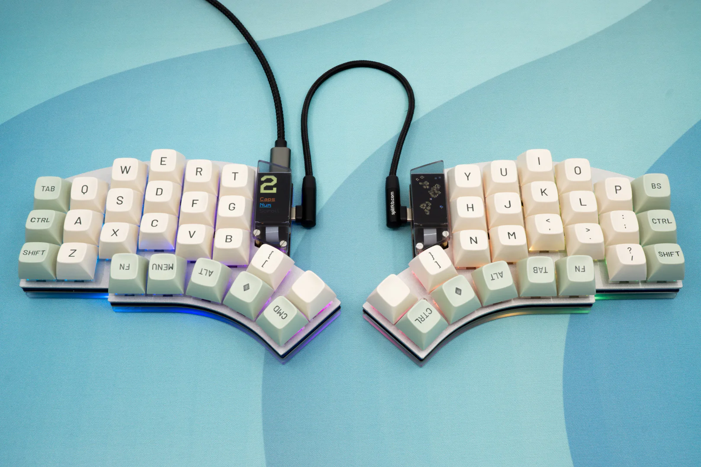

# Keyboard Configs

This is a repo of my personal collection of firmware (QMK and ZMK) and hardware accessories for my ergonomic keyboards.

| Name | Image |
| :--- | :--- |
| [Kyria](kyria) |  |
| [Lotus58](lotus58) |  |
| [Silakka54](silakka54) |  |

## Features

While the specifics of each keyboard can vary, they generally all feature:

- **Homerow mods** - Timerless home row mods as described in [urob's config](https://github.com/urob/zmk-config).
- **Symbol layer** - Optimized for programming inspired by [ShelZuuz](https://getreuer.info/posts/keyboards/symbol-layer/index.html)'s layout.
- **Gaming layer** - Dedicated layer for gaming.

## Keymappings

Here's the keymapping layout for my Kyria keyboard. My other keyboards may vary slightly, but will have a very similar layout.

## Resources

- [QMK Documentation](https://docs.qmk.fm/)
- [ZMK Documentation](https://zmk.dev/)
- [urob's ZMK Config](https://github.com/urob/zmk-config)
- [Miryoku](https://github.com/manna-harbour/miryoku)
