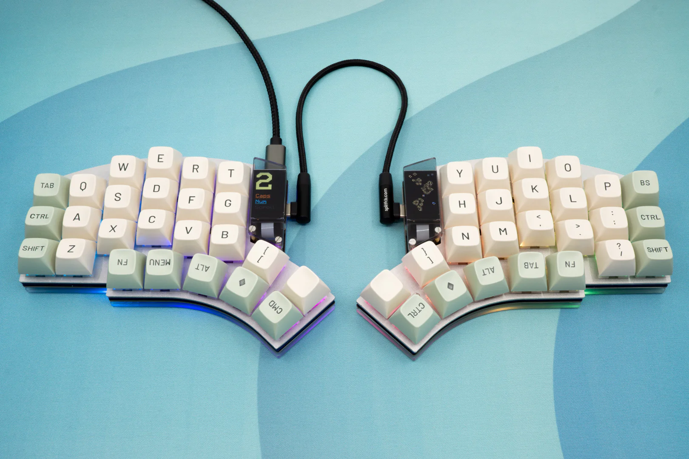
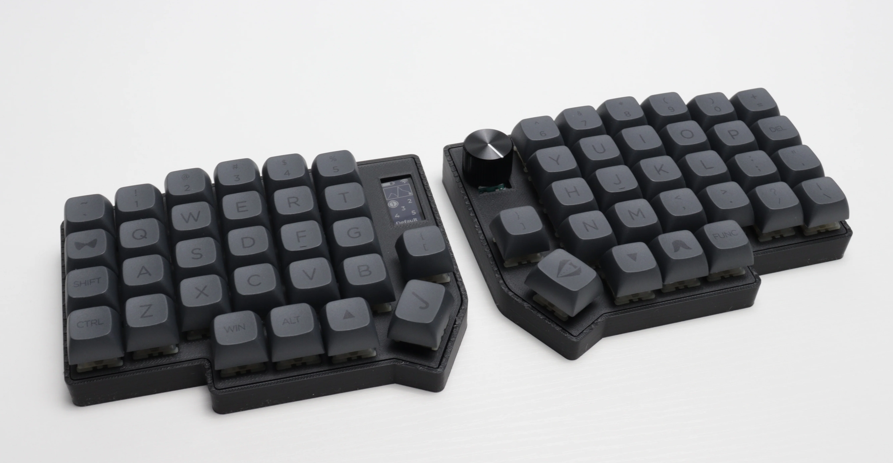
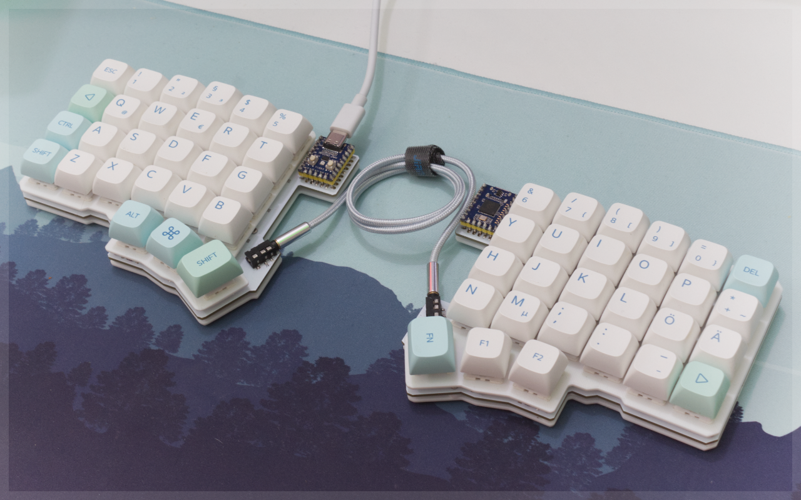
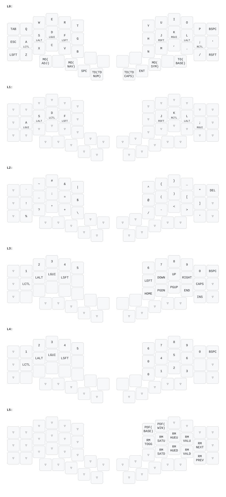

# Keyboard Configs

This is a repo of my personal collection of firmware (QMK and ZMK) and hardware accessories for my ergonomic keyboards.

| Name                   | Image                                   |
| :--------------------- | :-------------------------------------- |
| [Kyria](kyria)         |     |
| [Lotus58](lotus58)     |  |
| [Silakka54](silakka54) |       |

The keymap generation script also uses `keymap-drawer`, which is installed automatically via `uv` when needed.

## Features

While the specifics of each keyboard can vary, they generally all feature:

- **Homerow mods** - Timerless home row mods as described in [urob's config](https://github.com/urob/zmk-config).
- **Symbol layer** - Optimized for programming inspired by [ShelZuuz](https://getreuer.info/posts/keyboards/symbol-layer/index.html)'s layout.
- **Gaming layer** - Dedicated layer for gaming.

## Keymappings

Here's the keymapping layout for my Kyria keyboard. My other keyboards may vary slightly, but will have a very similar layout.



## Local development

The firmware for my keyboards is setup to be built locally.

### Pre-requisitebs

You'll need the following tools locally.

- [`Docker`](https://www.docker.com/) - For running QMK builds in containers
- [`uv`](https://docs.astral.sh/uv/) - Python package manager
- [`clang-format`](https://clang.llvm.org/docs/ClangFormat.html) - For C code formatting

### Commands

This project includes utility scripts in the `bin` directory for building, testing, and managing keyboard configurations.

### setup.sh

Initializes the development environment by cloning the QMK firmware repository at a specific version.

**Usage:**

```bash
./bin/setup.sh
```

### build.sh

Compiles keyboard firmware using QMK's Docker build system.

**Usage:**

```bash
./bin/build.sh
```

### keymap-gen.sh

Generates visual keymap diagrams from keyboard configurations using the keymap-drawer tool.

**Usage:**

```bash
./bin/keymap-gen.sh
```

### format.sh

Formats C source code files according to the project's clang-format configuration.

**Usage:**

```bash
./bin/format.sh
```

## Resources

- [QMK Documentation](https://docs.qmk.fm/)
- [ZMK Documentation](https://zmk.dev/)
- [urob's ZMK Config](https://github.com/urob/zmk-config)
- [Miryoku](https://github.com/manna-harbour/miryoku)
